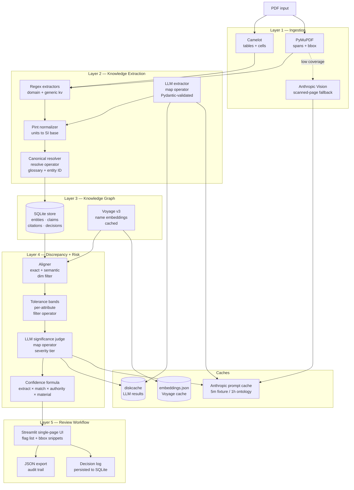
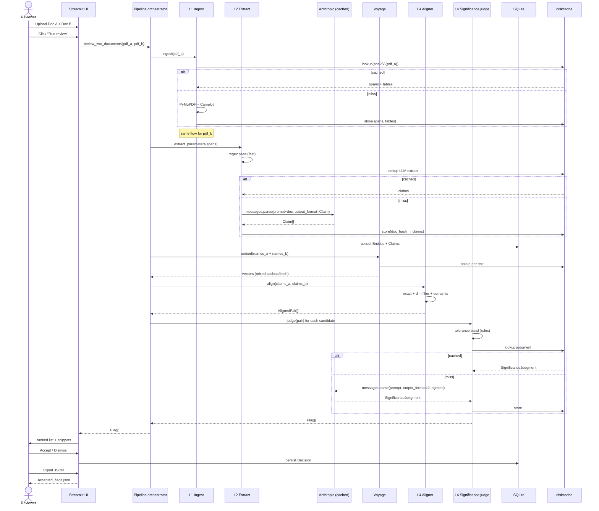
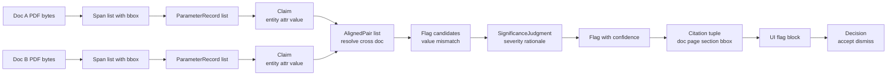
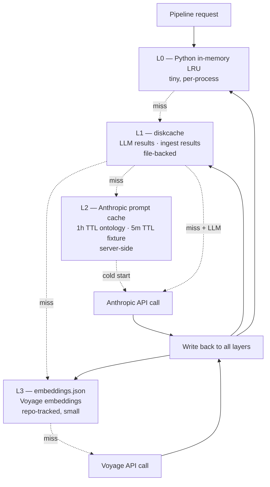

# InterLock AI — Architecture

> **Companion to `docs/PRD.md` §4 (5-layer model) and `docs/TDD.md` §5–7.** This document holds the architectural diagrams, control + data flows, persistence layers, cache hierarchy, and operational metrics. Keep it visual; keep prose elsewhere.

## 1. System overview (component view)



## 2. Control flow — single review session (sequence)



## 3. Data flow — types and transformations



## 4. Cache hierarchy



**Read priorities (top down):**
1. **L0 — in-memory.** `functools.lru_cache` on hot pure functions (unit normalization, canonical-name lookup). Lost on restart.
2. **L1 — diskcache.** Persistent file-backed KV. Key: `(content_sha256, function, args_sha256, prompt_version)`. Value: pickled Pydantic object. Survives across runs.
3. **L2 — Anthropic prompt cache.** Server-side prefix match. Reduces LLM input cost ~90 % on repeat calls within TTL.
4. **L3 — embeddings.json.** Voyage v3 vectors keyed by `sha256(canonical_name)`. Tracked in repo (small) so a fresh clone has the warm cache.
5. **Live APIs.** Voyage and Anthropic — last resort.

**Cache invalidation triggers:**
- Source PDF hash changes → invalidate ingest + extract + claims for that doc
- Prompt version bump (`PROMPT_V = "v3"`) → invalidate LLM cache for that prompt
- Glossary edit → bump `GLOSSARY_VERSION` → invalidate all alignment runs
- Model change (`claude-opus-4-7` → `claude-sonnet-4-6`) → cache key includes model

## 5. Persistence layout

```
data/                          # gitignored except for schema + embeddings cache
├── cache/                     # diskcache files
│   ├── cache.db
│   ├── cache.db-shm
│   └── cache.db-wal
├── interlock.db               # SQLite — entity/claim/citation/decision
├── interlock.schema.sql       # tracked
├── embeddings.json            # tracked (small, warm-start)
└── results/                   # eval outputs
    ├── baseline.json          # tracked
    └── ab_comparison.json     # tracked
```

**SQLite schema (Phase 14 onward):**

```sql
CREATE TABLE entity (
  id            TEXT PRIMARY KEY,        -- "xfmr_001", "p_101", or "implicit_xfmr_eaton"
  type          TEXT NOT NULL,           -- transformer | pump | line | circuit | implicit
  label         TEXT NOT NULL,
  project_id    TEXT,                    -- optional, multi-project ready
  created_at    TIMESTAMP DEFAULT CURRENT_TIMESTAMP
);

CREATE TABLE claim (
  id            TEXT PRIMARY KEY,        -- sha256(entity_id + attribute + raw_value + doc_id + page)
  entity_id     TEXT NOT NULL REFERENCES entity(id),
  attribute     TEXT NOT NULL,           -- "impedance_pct", "rated_power_kva", ...
  raw_value     TEXT NOT NULL,
  normalized_magnitude REAL,
  normalized_unit TEXT,
  doc_id        TEXT NOT NULL,
  source_path   TEXT NOT NULL,
  page          INTEGER NOT NULL,
  bbox_x0       REAL NOT NULL,
  bbox_y0       REAL NOT NULL,
  bbox_x1       REAL NOT NULL,
  bbox_y1       REAL NOT NULL,
  section       TEXT,
  span_text     TEXT NOT NULL,
  extraction_version TEXT NOT NULL       -- "regex-v1" | "llm-claim-extract-v1"
);

CREATE TABLE decision (
  id            TEXT PRIMARY KEY,
  fixture_pair_id TEXT NOT NULL,
  flag_id       TEXT NOT NULL,
  verdict       TEXT NOT NULL,           -- "accepted" | "dismissed"
  reviewer      TEXT,                    -- future multi-reviewer
  rationale     TEXT,                    -- optional reviewer note
  created_at    TIMESTAMP DEFAULT CURRENT_TIMESTAMP
);

CREATE TABLE cost_event (
  id            INTEGER PRIMARY KEY AUTOINCREMENT,
  ts            TIMESTAMP DEFAULT CURRENT_TIMESTAMP,
  provider      TEXT NOT NULL,           -- "anthropic" | "voyage"
  model         TEXT,
  input_tokens  INTEGER,
  cache_read_tokens INTEGER,
  cache_write_tokens INTEGER,
  output_tokens INTEGER,
  est_cost_usd  REAL
);
```

## 6. LLM call patterns (DocETL operator vocabulary)


- **map (per-chunk LLM extract):** ingest doc text → `list[Claim]`. Single API call per doc with prompt caching: ontology block (1h TTL) + doc text block (5m TTL) + extraction instruction.
- **resolve (canonical name + entity):** the glossary in `align/semantic.py::_CANONICAL` is the deterministic resolver. Phase 14 extends with LLM-aided resolution for unknown shorthand. Entity IDs are inferred from textual tags ("XFMR-001"); claims with no explicit entity are linked to an `implicit_<doc_id>` placeholder.
- **gather (cross-chunk context):** not in MVP. Platform-path for prose-heavy docs (SEL paper).
- **reduce (alignment):** name + dim filter + semantic match → `list[AlignedPair]`. Currently rule-based; no LLM.
- **filter (suppression + tolerance):** per-attribute tolerance band drops within-tolerance differences. Confidence threshold drops low-signal pairs.
- **map (significance judgment):** per candidate flag → `SignificanceJudgment` (severity ∈ critical/major/minor/info + rationale + downstream effects). LLM call with cached ontology + glossary, fresh per-flag context.

## 7. Confidence formula (revised for Phase 13)

```
flag_confidence  = extraction_conf × match_conf × authority_conf × material_conf

severity_tier   = bucket(material_conf, deviation_pct, llm_judgment.severity)
                = critical if deviation ≥ 50 % (e.g. decimal shift)
                = major    if deviation ≥ 5  % (above typical tolerance)
                = minor    if deviation ≥ 1  % (review-worthy)
                = info     if deviation <  1 % (within manufacturing tolerance)
```

- `extraction_conf`: 1.0 for native PyMuPDF spans, <1.0 for vision-fallback pages weighted by Claude vision confidence.
- `match_conf`: 1.0 for exact-name pairs; Voyage cosine score on canonical-resolved pairs.
- `authority_conf`: 1.0 for the hardcoded MVP rule; <1.0 once Phase 15+ configurable authority lands.
- `material_conf`: 1.0 when `deviation_pct > tolerance_band`; scaled by relative-deviation curve when within band; LLM judgment can downgrade further when the parameter is contextually expected to differ (e.g. design vs operating values).

The four-factor formula is multiplicative — any factor at 0 suppresses the flag entirely. Default surface threshold remains 0.5.

## 8. Failure modes + mitigations

| Failure mode | Detection | Mitigation |
|---|---|---|
| Anthropic rate limit (429) | SDK exception | SDK auto-retry with exponential backoff (2 attempts default) |
| Anthropic 5xx | SDK exception | SDK auto-retry |
| Voyage rate limit | SDK exception | Fall back to cached vectors for known names; fail loudly for new names |
| Voyage non-determinism | Cosine drift between runs | Test asserts flag-parameter *set* stability, not absolute confidence |
| LLM returns malformed Pydantic | ValidationError from `messages.parse` | Retry once; on second failure surface to UI |
| Cache silent invalidator | `cache_read_input_tokens == 0` after warmup | CI test that asserts cache hit on second call with same prefix |
| Corrupt diskcache | OperationalError | Rebuild cache from scratch — all keys content-hashed so re-derivation is safe |
| SQLite lock contention | OperationalError | Streamlit is single-user; WAL mode + retry on busy |
| PDF parse failure | Exception in ingest | Surface to UI with low-coverage banner; offer vision fallback if Anthropic key present |
| Streamlit Cloud cold start | First request slow | Pre-warm tab before demo; ghostscript declared in `packages.txt` |
| Budget exhaustion | Anthropic 403 / usage limit | Per-call cost ledger in `cost_event` table; UI banner when projected cost > threshold |

## 9. Operational metrics (per pipeline run)

Tracked in `data/results/` and visible in the UI footer:

| Metric | Source | Acceptance |
|---|---|---|
| End-to-end latency | wall-clock around `review_two_documents` | < 90 s (SCOPE §6.2) |
| LLM cost per run | `cost_event` aggregate | < $0.30 in production; < $0.10 on cached repeat |
| Cache hit rate | `cache_read / (cache_read + input)` across LLM calls | > 60 % on second run; > 90 % on third+ |
| TP recall on gold set | `scripts/run_eval.py` | 100 % on locked gold sets (Option 1 + Option 2) |
| FP rate on traps | `scripts/run_eval.py` | 0 % |
| Coverage of low-coverage pages | `IngestResult.low_coverage_pages` | 0 on locked fixtures |
| Voyage embedding misses on warm cache | embeddings.json diff | 0 on locked fixtures after first run |

## 10. Vocabulary alignment with prior art

This system's operator names map to DocETL (UC Berkeley, VLDB 2025) and LOTUS (Stanford) semantic operators:

| Our stage | DocETL operator | LOTUS operator |
|---|---|---|
| Per-doc LLM extract | `map` | `sem_extract` |
| Canonical name + entity ID | `resolve` | `sem_join` (related, not identical) |
| Combine alignment results | `reduce` | n/a |
| Tolerance + threshold filter | `filter` | `sem_filter` |
| Per-flag significance judge | `map` | `sem_extract` |
| Cross-chunk context preservation | `gather` (DocETL) | n/a |
| Agentic plan optimization | DocETL's optimizer | n/a |

Using this vocabulary keeps the architecture legible to anyone who has read either paper.

---

**Diagram source:** all `mermaid` blocks render on GitHub natively. To export to PNG/SVG for slides, use any Mermaid CLI (`mmdc`) or `https://mermaid.live`.
