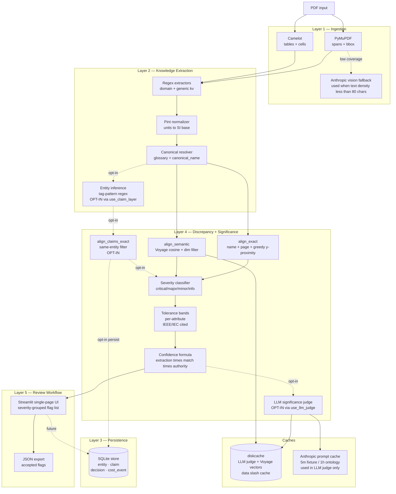
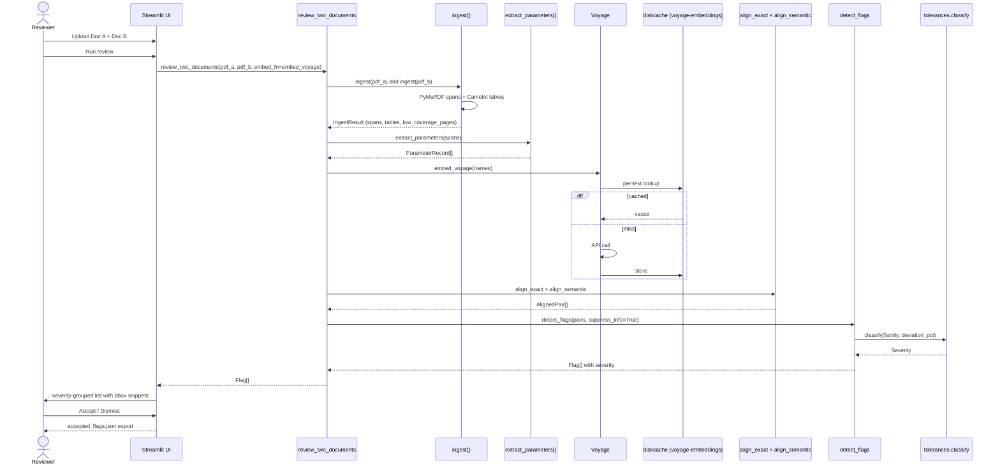
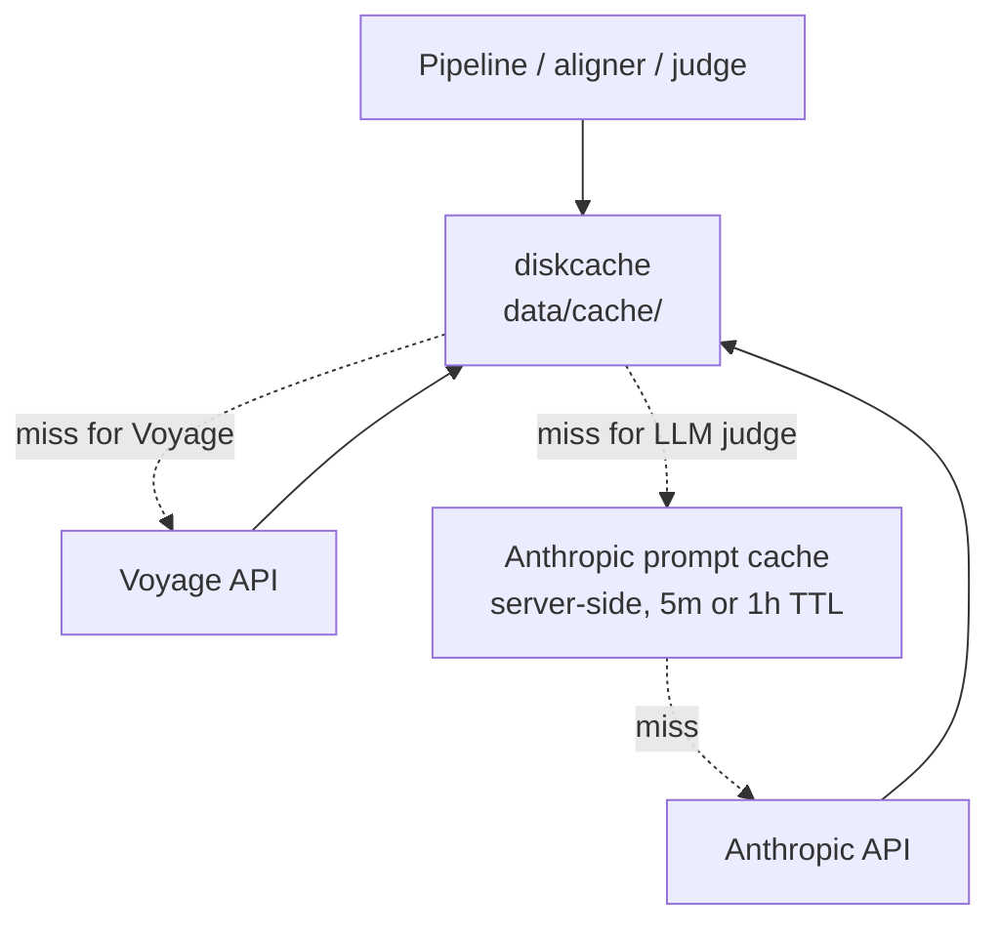
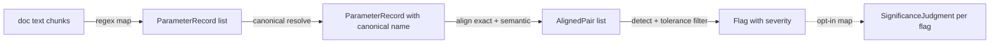

# InterLock AI — Architecture

> Companion to `docs/PRD.md` §4 (5-layer model) and `docs/TDD.md`. This document holds the diagrams, control + data flows, persistence layout, cache hierarchy, and operational metrics for what's actually shipped in **v1.5-mvp-ready**.
>
> Every claim below is verifiable in the repo at the tag `v1.5-mvp-ready`. If you find a discrepancy, it's a bug in the doc, not in the code.

---

## 1. System overview (component view)



**OPT-IN annotations:** the Entity + Claim layer (`use_claim_layer`), same-entity filtering, persistence to SQLite (`persist_claims`), and the LLM significance judge (`use_llm_judge`) are all opt-in parameters on `review_two_documents`. **Default v1.5 behavior is identical to v1.2: regex extraction + exact/semantic alignment + tolerance-based severity (Phase 13 addition) + no LLM in the runtime pipeline.** The Phase 14 entity layer is shipped infrastructure ready for fixtures with explicit equipment tags on both sides.

## 2. Control flow — default single review session (v1.5)

This is the actual default path through `review_two_documents` with no opt-ins enabled. The Streamlit demo runs exactly this flow.



**Opt-in extensions** (`use_claim_layer=True`, `use_llm_judge=True`, `persist_claims=True`) layer additional steps onto this flow; see source `src/interlock/pipeline.py::review_two_documents`.

## 3. Data flow — types and transformations

```mermaid
graph LR
    PDFa[Doc A PDF bytes] --> Spansa[Span list with bbox]
    PDFb[Doc B PDF bytes] --> Spansb[Span list with bbox]
    Spansa --> Paramsa[ParameterRecord list]
    Spansb --> Paramsb[ParameterRecord list]
    Paramsa -.opt-in use_claim_layer.-> Claimsa[Claim with Entity]
    Paramsb -.opt-in use_claim_layer.-> Claimsb[Claim with Entity]
    Paramsa --> Pairs[AlignedPair list]
    Paramsb --> Pairs
    Claimsa -.opt-in.-> Pairs
    Claimsb -.opt-in.-> Pairs
    Pairs --> Detect[detect_flags + severity]
    Detect --> Flags[Flag with severity, deviation_pct]
    Flags -.opt-in use_llm_judge.-> Judged[Flag enriched with SignificanceJudgment]
    Flags --> Cites[render_citation per Flag]
    Cites --> UIFlag[UI flag block with bbox snippet]
    UIFlag --> Decisions[Accept/Dismiss + JSON export]
```



## 4. Cache hierarchy



**What's actually cached:**

| Caller | Cache | Key | TTL |
|---|---|---|---|
| `align/embed.py` | diskcache namespace `voyage-embeddings` | `sha256(text)` per name | persistent until cleared |
| `detect/significance.py` | diskcache namespace `llm-significance` | `sha256({prompt_version, flag_id, doc_a/b, raw_a/b})` per flag | persistent until cleared |
| `detect/significance.py` system prompt | Anthropic prompt cache (server-side) | prefix match on system blocks | 1 hour TTL on ontology block, 5 minute TTL on per-flag user block |

**Not cached at this version:** `ingest()` output (PyMuPDF + Camelot), `extract_parameters()` output, and `align_exact()` output. They are deterministic and cheap; adding diskcache layers around them is a Phase-19 follow-up.

**No `functools.lru_cache`** is currently used in `src/`. The earlier doc claimed an L0 in-memory layer; the actual L0 is just the diskcache (which transparently caches in process).

**Cache invalidation:** all keys include the SHA-256 of their semantic inputs. Changing the prompt template, the Voyage model, the Anthropic model, or the input text changes the key. There is no explicit "version bump"; rotate constants in code and old keys become unreachable.

## 5. Persistence layout

```
data/                          # gitignored body, schema + results tracked
├── cache/                     # diskcache files (gitignored)
│   ├── cache.db
│   ├── cache.db-shm
│   └── cache.db-wal
├── interlock.db               # SQLite — entity/claim/decision/cost_event (gitignored)
└── interlock.schema.sql       # tracked

eval/
└── results/                   # tracked
    ├── baseline.json          # Option 1 gold-set scoring
    └── ab_comparison.json     # Option 1 vs Option 2 comparison
```

**Schema (`data/interlock.schema.sql` — applied idempotently by both `cache/cost_ledger.py` and `store/sqlite.py`):**

```sql
-- Phase 13: cost ledger
CREATE TABLE IF NOT EXISTS cost_event (
  id                      INTEGER PRIMARY KEY AUTOINCREMENT,
  ts                      TEXT NOT NULL DEFAULT (datetime('now')),
  provider                TEXT NOT NULL,         -- 'anthropic' | 'voyage'
  model                   TEXT,
  namespace               TEXT NOT NULL,         -- caller workstream label
  input_tokens            INTEGER NOT NULL DEFAULT 0,
  cache_read_tokens       INTEGER NOT NULL DEFAULT 0,
  cache_creation_tokens   INTEGER NOT NULL DEFAULT 0,
  output_tokens           INTEGER NOT NULL DEFAULT 0,
  est_cost_usd            REAL NOT NULL DEFAULT 0.0
);

-- Phase 14: entity + claim + decision (claim and decision used only when
-- use_claim_layer / persist_claims are enabled on the pipeline)
CREATE TABLE IF NOT EXISTS entity (
  id          TEXT PRIMARY KEY,
  type        TEXT NOT NULL,
  label       TEXT NOT NULL,
  project_id  TEXT,
  created_at  TEXT NOT NULL DEFAULT (datetime('now'))
);

CREATE TABLE IF NOT EXISTS claim (
  id                    TEXT PRIMARY KEY,        -- sha256(entity_id|attribute|raw_value|doc_id|page)
  entity_id             TEXT NOT NULL REFERENCES entity(id),
  attribute             TEXT NOT NULL,
  raw_value             TEXT NOT NULL,
  normalized_magnitude  REAL,
  normalized_unit       TEXT,
  doc_id                TEXT NOT NULL,
  source_path           TEXT NOT NULL,
  page                  INTEGER NOT NULL,
  bbox_x0               REAL NOT NULL,
  bbox_y0               REAL NOT NULL,
  bbox_x1               REAL NOT NULL,
  bbox_y1               REAL NOT NULL,
  section               TEXT,
  span_text             TEXT NOT NULL,
  extraction_version    TEXT NOT NULL,
  created_at            TEXT NOT NULL DEFAULT (datetime('now'))
);

CREATE TABLE IF NOT EXISTS decision (
  id                INTEGER PRIMARY KEY AUTOINCREMENT,
  fixture_pair_id   TEXT NOT NULL,
  flag_id           TEXT NOT NULL,
  verdict           TEXT NOT NULL,
  reviewer          TEXT,
  rationale         TEXT,
  created_at        TEXT NOT NULL DEFAULT (datetime('now'))
);
```

**What's persisted by default in v1.5:** only `cost_event` rows when the LLM judge or vision fallback fires. The `entity` / `claim` / `decision` tables exist and have working CRUD via `src/interlock/store/sqlite.py`, but the runtime pipeline only writes to them when `persist_claims=True` is passed explicitly. The Streamlit UI does not currently write `decision` rows (accepted-flag export goes to JSON instead). Wiring the UI to the `decision` table is a Phase-19 task.

## 6. LLM call patterns

**One LLM call site in v1.5:** the optional significance judge in `src/interlock/detect/significance.py`. Vision fallback is implemented in `src/interlock/ingest/vision_fallback.py` but is not exercised by the default fixtures (they have zero low-coverage pages).



DocETL vocabulary alignment:

- **map (regex):** `extract_parameters` runs a deterministic regex pass to lift `ParameterRecord` from spans. **No LLM extraction is shipped in v1.5.** Prose-heavy doc extraction (SEL paper) is a known limitation — see `docs/BACKLOG.md`.
- **resolve:** `align/semantic.py::canonical_name` collapses synonyms (`%Z`, `Rated Impedance`, etc.) into a single canonical phrase used downstream. Entity inference (`extract/entities.py::infer_entity_from_text`) is the second resolver tier — opt-in via `use_claim_layer`.
- **reduce:** exact (`align_exact`) + Voyage semantic (`align_semantic`) + combiner (`combiner.py::combine_alignments`) reduce two record lists to `AlignedPair[]`. Rule-based throughout.
- **filter:** `detect_flags(suppress_info=True)` drops within-tolerance changes. Severity classifier in `detect/tolerances.py::classify` does the bucketing.
- **map (significance):** opt-in. Anthropic Opus 4.7 via `messages.parse(output_format=SignificanceJudgment)` with two-tier prompt cache (1 hour on system / ontology blocks, 5 minutes on per-flag user blocks). Disk-cached per flag, so the second run pays effectively zero.

## 7. Confidence formula + severity tiers (as shipped)

```
flag_confidence = extraction_confidence × match_confidence × authority_confidence
```

Three factors, multiplicative, all clamped to `[0, 1]`. Implemented in `src/interlock/detect/confidence.py::flag_confidence`. The earlier draft of this doc described a four-factor formula with a `material_conf` term; that was a design sketch, not what shipped. Material significance lives separately in the **severity tier**, not in the multiplied confidence.

**Severity tiers** are computed in `detect/mismatch.py::detect_flags` via `detect/tolerances.py::classify(family, deviation_pct)`. Per-family bands cited at `src/interlock/detect/tolerances.py::TOLERANCE_TABLE`:

| Attribute family | Source citation | tolerance% | major% | critical% |
|---|---|---:|---:|---:|
| `impedance_pct` | IEEE C57.12.00-2015 §9.1 Table 17 | 7.5 | 20.0 | 50.0 |
| `rated_power_kva` | IEEE C57.12.00-2015 §5.10 + NEMA TR 1-2013 | 5.0 | 10.0 | 50.0 |
| `voltage_kv` | IEC 60076-1:2011 §5.3 + IEEE C57.12.00-2015 §5.7 | 0.5 | 5.0 | 50.0 |
| `fault_current_a` | industry-typical; IEEE Std 242 (Buff Book) | 5.0 | 20.0 | 50.0 |

- below `tolerance%` → `info` (suppressed by default in `detect_flags`)
- between `tolerance%` and `major%` → `minor`
- between `major%` and `critical%` → `major`
- at or above `critical%` → `critical`

**Honest framing:** these are shipped industry-typical defaults and not the right values for every project. See `docs/TDD.md` §4B and `set_tolerance_overrides()` for the runtime override hook intended for project-specific bands.

## 8. Failure modes + mitigations

| Failure mode | Detection | Mitigation in v1.5 |
|---|---|---|
| Anthropic rate limit / 5xx | SDK exception | Anthropic SDK auto-retries with exponential backoff (default 2 attempts). Per-call cost tracked in `cost_event`. |
| Voyage rate limit / error | SDK exception | Cached vectors served from diskcache for known names; new names fail loudly to the caller. |
| Voyage non-determinism between calls | Cosine drift across runs | `tests/real_world/test_pipeline_behaviors.py` asserts flag *parameter-set* stability, not absolute confidence values. |
| LLM returns malformed JSON | `ValidationError` from `messages.parse` | Bubbles up; caller of `detect/significance.py::judge` decides retry behavior. |
| Cache silent invalidator | `cache_read_input_tokens == 0` after a warm call | `tests/llm/test_client.py::test_call_structured_cache_fires_on_repeat_with_large_cached_prefix` is the canary. |
| PDF parse failure | Exception in `ingest` | Surfaces to Streamlit as a Python traceback (current behavior). Friendlier error UI is a Phase-19 task. |
| Streamlit Cloud cold start | First request slow | Pre-warm tab; `packages.txt` installs ghostscript so Camelot lattice mode works on the runner. |

## 9. Operational metrics (as measured on Option 1 fixtures)

These numbers are from the most recent local + Streamlit Cloud runs at tag `v1.5-mvp-ready`.

| Metric | Source | Measured |
|---|---|---|
| Full test suite (slow excluded) | `uv run pytest` | 294 passed, 7 deselected, ~3:38 wall-clock |
| End-to-end Option 1 pipeline | `tests/real_world/test_pipeline_behaviors.py` (stub embed) | < 10 s |
| TP recall on Option 1 gold | `eval/results/baseline.json` | 100% (3 of 3 planted TPs) |
| FP rate on Option 1 traps | `eval/results/baseline.json` | 0% (0 of 2 traps surfaced) |
| A/B Option 1 vs Option 2 | `eval/results/ab_comparison.json` | Option 2 surfaces 3 flags via semantic alignment that Option 1 has 0 exact pairs for |
| Anthropic spend during build | local cost_event aggregate | ~$0.20 total across Phase 13 development |

## 10. Vocabulary alignment with prior art

The operator names used in this codebase are intentionally aligned with DocETL (UC Berkeley EPIC Lab, VLDB 2025) and LOTUS (Stanford) so anyone who has read either paper can read this code quickly.

| Our stage | DocETL operator | LOTUS operator |
|---|---|---|
| Regex extraction per chunk | `map` (deterministic variant) | `sem_extract` (their LLM variant) |
| Canonical name + entity inference | `resolve` | `sem_join` (related, not identical) |
| Combine alignment results | `reduce` | n/a |
| Tolerance + suppress-info filter | `filter` | `sem_filter` |
| Per-flag significance judge | `map` (LLM variant) | `sem_extract` |

We do not ship DocETL itself; we adopt its vocabulary. Adopting the framework is in `docs/BACKLOG.md` as Phase 21+.

---

**Diagram rendering:** all `mermaid` blocks render natively on GitHub. For slide export, use any Mermaid CLI (`mmdc`) or `https://mermaid.live`.

**How to verify any claim above:** every claim has a source path. The fastest sanity check is `rg <symbol-name> src/` to confirm the code matches the description.
